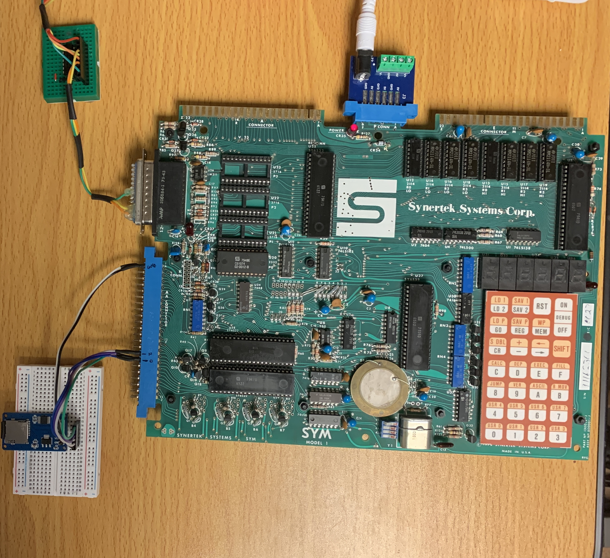

# A Demo of the SYM-1 (6502) Reading a SD Card

## This project's Starting Point
In general, the [sdcard6502](https://github.com/gfoot/sdcard6502) project was used as a starting point.  
It's recommended to take a look at it for more background information.  
Much of what is documented there is relevant to this project.

### Difference from sdcard6502 Project
* Convert to a Makefile-based build system
* Convert source to CC65 toolchain standards.
* Remove LCD support code, replace with serial console messages.
* Consolidate zero-page variables into one file.

## Overview

Below is a photo an overview of the hardware setup for this demo.  

 

## The Development and Testing Setup
All development and testing is on **Ubuntu 24.04 LTS**, and using the **CC65** toolchain.  
The terminal app, **minicom**, was used on the Ubuntu system to interact with the SYM-1.  
There are many guides and videos on the internet showing how to serially connect to the SYM-1 to a computer, so that won't be detailed here.

### Makefile Build
This project use the standard **make** supported by Ubuntu.  
Review the Makefile file and make adjustments to point to your CC65 installation.
```
#
# Remember to set CC65_HOME in your .bashrc file.
#   example:  export CC65_HOME="~/sym1/cc65"
#
AS = $(CC65_HOME)/bin/ca65
CC = $(CC65_HOME)/bin/cc65
CL = $(CC65_HOME)/bin/cl65
LD = $(CC65_HOME)/bin/ld65
DA = $(CC65_HOME)/bin/da65
```
  
## Hardware Guide
**There is seperate section on hardware:** click [here](guides/Hardware.md) to go to it.

## Preparing the SD Card
An 8-Gbyte SD Card (SDHC) was configured with Gpartd: one FAT32 partition of type "c" (not "b").  
It's recommended to do a full formatting, not the quick formatting.  
Create a directory named "SUBFOLDR" on the SD Card, and then a file under this directory named "DEEPFILE.TXT".  
The contents of the file can be anything, but is suggested to fill the file with ASCII text of no more that 512 bytes.  
This code was tested with a simple, two-line content shown below (keep it simple).  
```
This is some text
and here is more
```

## Example of Console Messaging
Below shows messages displayed on the serial console 
```
SYM-1 FAT32 File System Demo
Initialize SDCard...OK
Initialize File System...OK
Open Root

LBA:0820
Find Directory Entry: SUBFOLDR   

LBA:7FE0

LBA:0820
Find File: DEEPFILETXT

LBA:7FE8
Open File: 
LBA:0820
Read File: 
LBA:7FF0


Filesize: 23
This is some tex
t
 and here is more

.
```
