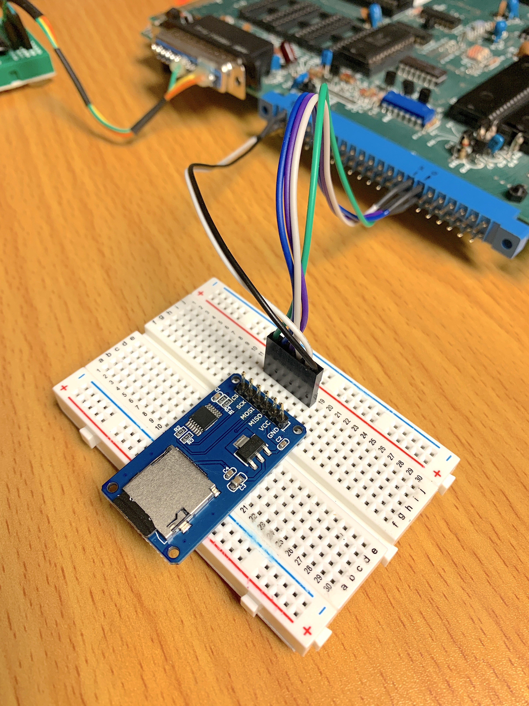
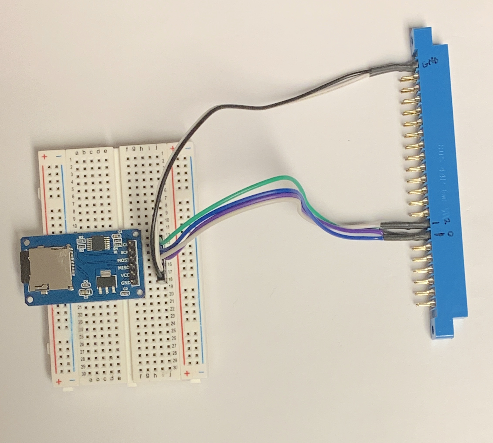
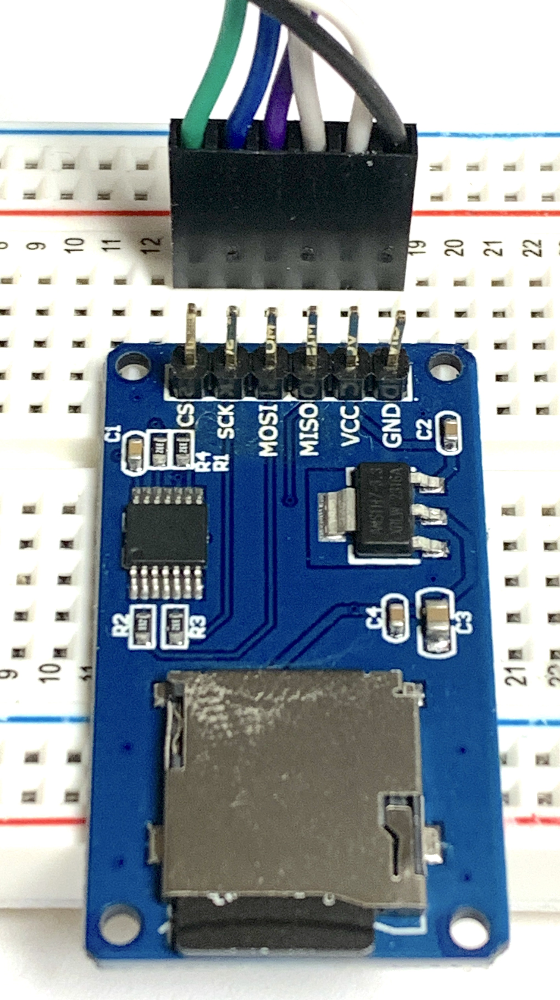
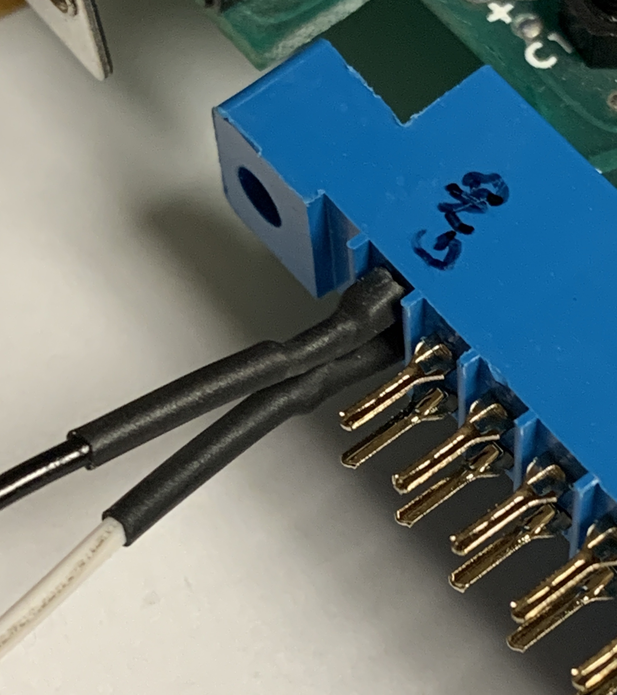
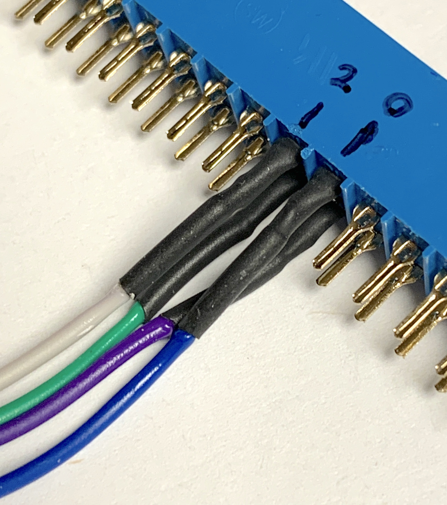

# A Demo of the SYM-1 (6502) Reading a SD Card

## Prerequisites
* A SYM-1 board with SuperMonitor V1.1, with 4K of RAM.
* A [power supply board](https://retro-spy.com/product/power-supply-board-for-sym-1-sbc)
* A USB-to-serial cable with inverters: there are many guides elsewhere to establish a serial connection.
* A **MicroSD Card Adapter** with level-shifter
* A SD Card that's SDHC compliant: 8 GByte was used.
* A Solderless breadboard
* Jumper wires with 0.1" male headers: six wires.
* Shrink-wrap: 6 inches.
* Soldering iron and solder.

### Optionals
* Logic Analyzer or Oscilloscope which supports SPI and SDCard protocols: Saleae Logic-8 was used.

## Hardware Photos
Here is a close-up photos of the physical wiring connecting the SD Card reader to the SYM-1's *AA connetor*.  

  

## SYM-1 VIA and Edge Connector Mapping  
The SPI bus is wired as shown blow.  
Note that only **PORTB** on **VIA-3** (U29) is actually used.
```
PORTB = $AC00
PORTA = $AC01
DDRB  = $AC02
DDRA  = $AC03

SCK  : %00000001  - PB0 - Serial Clock
MOSI : %00000010  - PB1 - Master Out Slave In
MISO : %00000100  - PB2 - Master In Slave In
CS   : %00001000  - PB3 - Chip Select
```

On the **Auxiliary Application (AA)** edge connector, the following pin associations are shown.  
See the [**SYM-1 Reference Manual**](http://www.6502.org/trainers/synertek/manuals/srefman.pdf) page 4-7 for details  

```
15  PB2   |  S  PB3
16  PB0   |  T  PB1
```


## Edge Connector Pinout
Here is a listing of 44-pin [edge connectors](https://www.amazon.com/s?k=Card+Edge+Connector+Blue+Socket+44+Pin+3.96mm+Pitch&i=electronics&crid=1OSWNDW17LWQ6&sprefix=card+edge+connector+blue+socket+44+pin+3.96mm+pitch+%2Celectronics%2C258&ref=nb_sb_noss_1).

Below are some close-up photos of the wiring to the edge connector.

  

 

   

  

